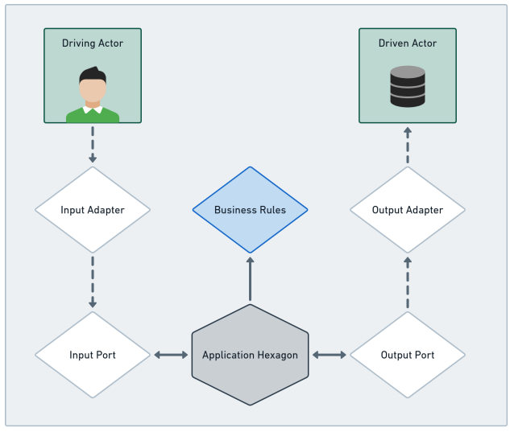
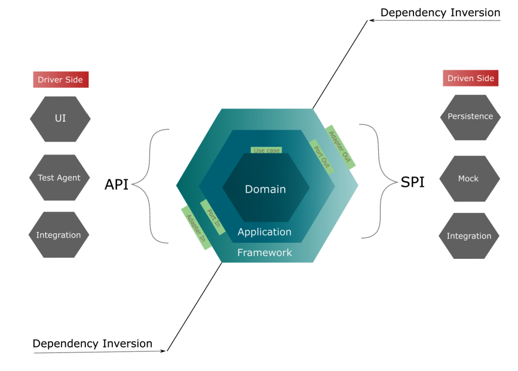

# POC DE ARQUITETURA HEXAGONAL NO QUARKUS

Resumo do Sistema - PoC da Arquitetura Hexagonal
Este sistema é uma Prova de Conceito (PoC) que demonstra a aplicação prática da Arquitetura Hexagonal, enfatizando meu
conhecimento em arquitetura de software e domínio Java. O foco principal foi isolar as regras de negócio da tecnologia,
utilizando o conceito de portas e adaptadores, o que resulta em um design de software flexível e adaptável.

Características Principais
Isolamento de Regras de Negócio: O núcleo da aplicação (domínio e hexágono de aplicação) é mantido livre de dependências
de frameworks ou atores externos, garantindo a pureza das regras de negócio.

Agnosticismo a Banco de Dados: A estrutura foi projetada para ser agnóstica em relação ao armazenamento de dados,
permitindo a integração com diferentes tipos de bancos de dados, seja em memória, relacional ou não relacional.
Flexibilidade e Manutenibilidade: A arquitetura hexagonal permite a fácil substituição de componentes e tecnologias,
facilitando a manutenção e evolução do sistema.
Funcionalidades da PoC

Cadastro de Players e Partidas: O sistema permite o registro de jogadores (players) e a criação de partidas, formando a
base para um sistema mais complexo.
Potencial para Sistema de Ranking: A estrutura atual suporta a expansão para um sistema de ranking de jogadores, ideal
para campeonatos e competições.
Tecnologias e Práticas Utilizadas

Java: Linguagem principal para o desenvolvimento do sistema.

Princípios de Padroes: Aplicação dos princípios de Arquitetura para garantir um código limpo e bem organizado.

Testes de Negocio.

Este resumo fornece uma visão clara do propósito, das características principais e das funcionalidades da sua PoC,
destacando a aplicação da Arquitetura Hexagonal e seu conhecimento em arquitetura de software e programação Java






## Sistemas de gerenciamento de partidas

Maven 3.8.7

Docker

Docker Compose

Executando a Aplicação
Para rodar a aplicação, siga os passos abaixo:

rodar na raiz do projeto

```
$ mvn clean package
```

rodar na raiz do projeto

```
$ docker-compose up -d
```

Para testar se a aplicação está funcionando navegue ate

```
http://localhost:8080/q/swagger-ui/
```

Para testar a aplicação, utilize o swagger ou o postman
Exemplo de json

```json
{
  "matchWeight": 10,
  "players": [
    {
      "id": "PLAYER37KV33CUCP9Y3GB"
    },
    {
      "email": "sullivankrista@gmail.com"
    },
    {
      "id": "PLAYER3ZK893GW7FL6KJD",
      "email": "michael21@gmail.com"
    }
  ],
  "date": "2023-11-01T00:00:00.000Z",
  "local": "Casa do Esdras"
}

```
